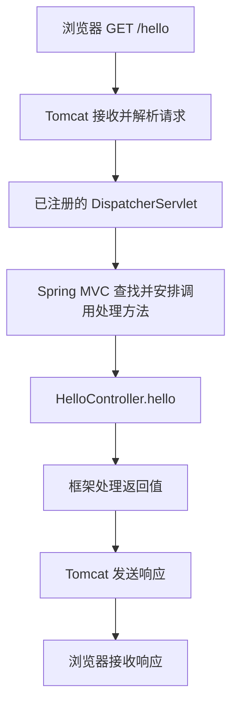
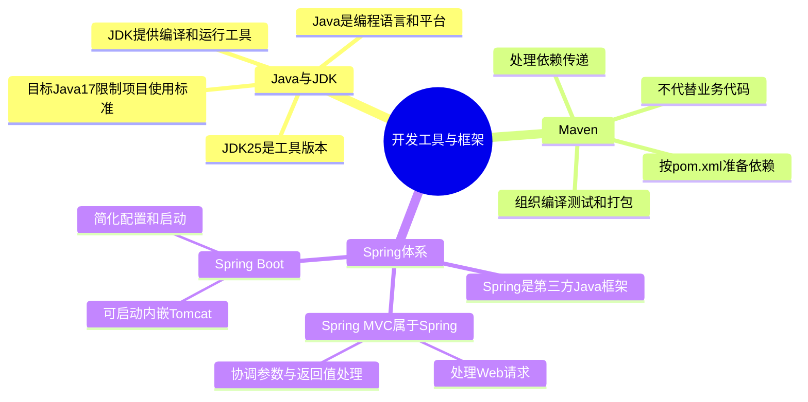
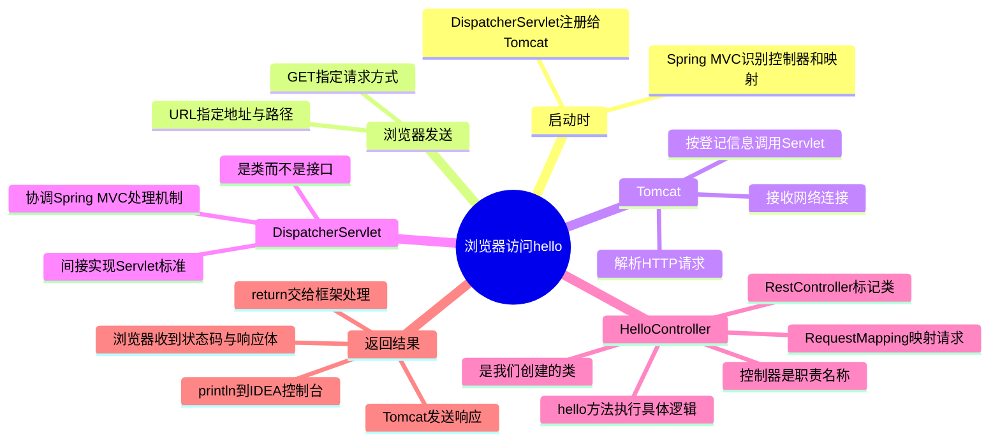
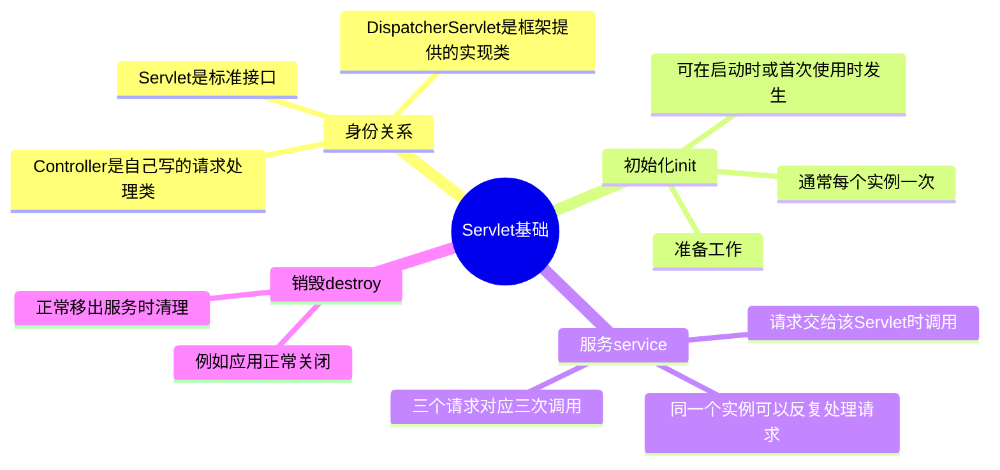
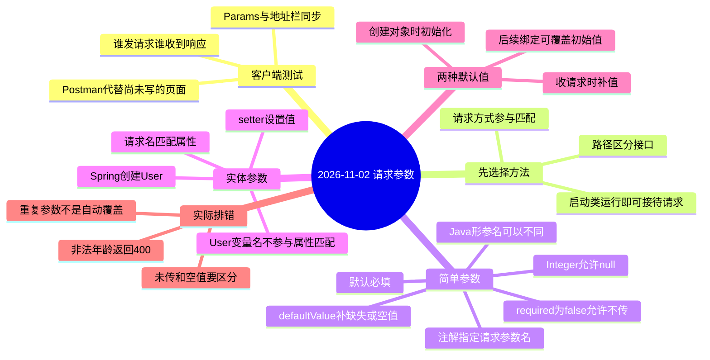
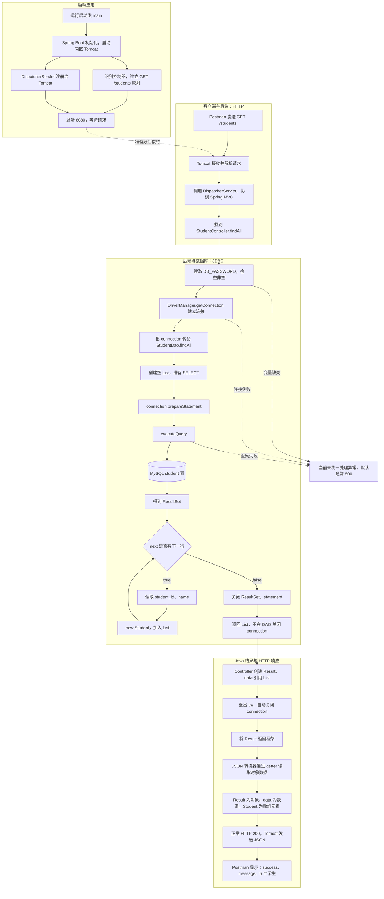
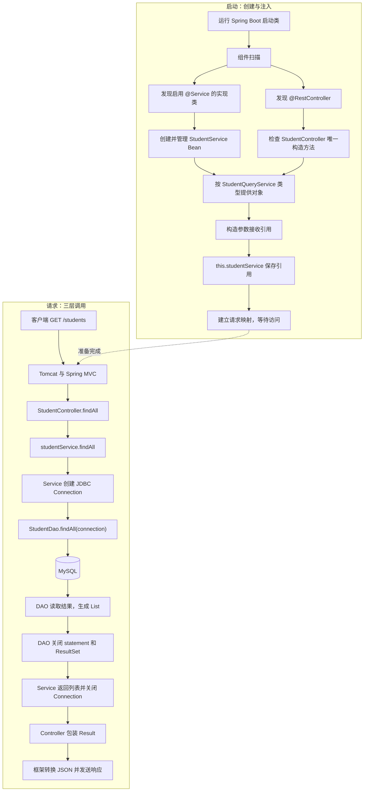
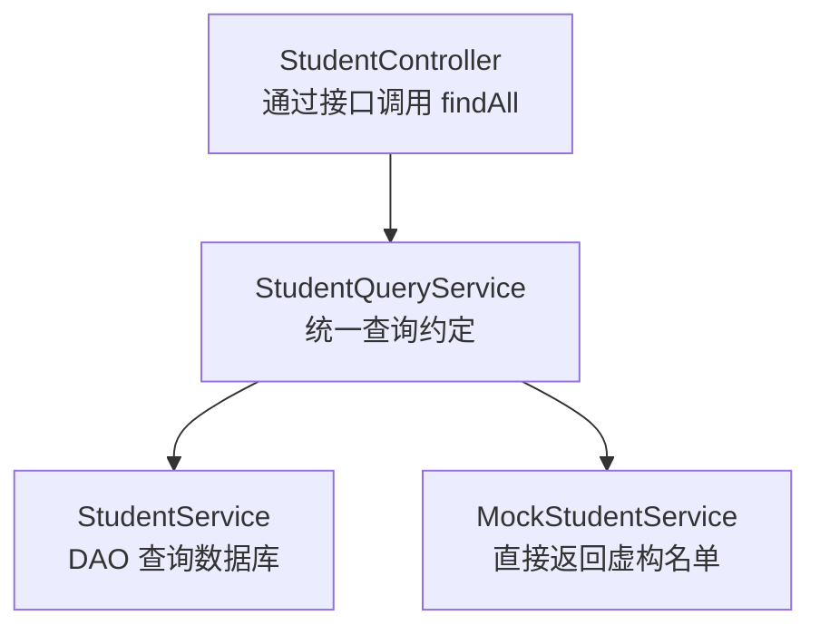
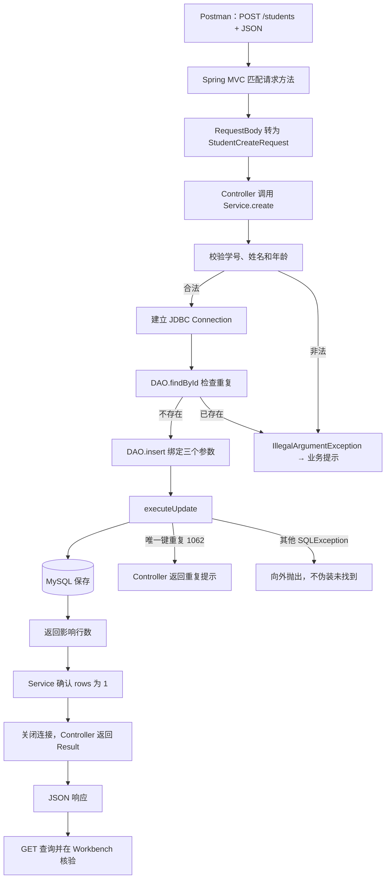

# JavaWeb 学习记录

从“浏览器怎样调用我写的 Java 方法”出发，整理 AI 全栈成长营 Level 2「JavaWeb 核心技术」的学习过程。这里既保存进度，也把学习中真正困惑过的问题讲清楚，供以后回看。

不要求一开始记住所有框架名字。先抓住主线：**Maven 准备项目依赖，Spring Boot 帮助启动应用，Tomcat 接收请求，Spring MVC 安排调用我们写的方法。**

> 仓库记录起始：2026-10-28（Maven 历史记录）；JavaWeb 正式记录起始：2026-10-29。
> 最近更新：2026-11-06。后续按实际学习日期持续追加；日期表示学习时间，补录或复制日期另行标明。

> 示例说明：本文中的人名、学号均已改为示例化表述，仅用于解释代码与请求格式，不保证与本机数据库记录对应。运行验收只记录条数、字段及行为，不公开数据库名单原值。

## 日期导航与代码目录

| 学习日期 | 主题 | 笔记与代码 |
|---|---|---|
| 2026-10-28 | Maven 环境、依赖、POM 和下载故障排查 | [原记录副本](notes/2026-10-28/maven.md) · [原项目配置](MavenStudy/pom.xml) |
| 2026-10-29 | JavaWeb 入门、请求响应和 Servlet 基础 | [当天记录](#2026-10-29web-入门与请求处理链路) · [Spring Boot 工程](SpringBoot_javaWeb_quickstart) |
| 2026-11-02 | Postman、简单参数、实体参数、默认值与可选参数 | [当天问答总结](#day-2026-11-02) · [HelloController](SpringBoot_javaWeb_quickstart/src/main/java/com/zhangyihang/springboot_javaweb_quickstart/Controller/HelloController.java) · [User](SpringBoot_javaWeb_quickstart/src/main/java/com/zhangyihang/springboot_javaweb_quickstart/pojo/User.java) |
| 2026-11-03 | 嵌套对象、数组/List、日期/JSON/路径参数、响应包装、JDBC 接口整合 | [当天总结](#day-2026-11-03) · [接口清单](#endpoints-2026-11-03) · [完整流程图](#flow-2026-11-03) |
| 2026-11-04 | 三层架构、接口解耦、IOC/DI、真实/模拟查询切换与验证 | [当天问答总结](#day-2026-11-04) · [分层与注入流程图](#flow-2026-11-04) · [AI Coding 与验收](#ai-coding-2026-11-04) |
| 2026-11-06 | 按学号查询、POST 新增、业务校验、重复处理与边界验收 | [当天总结](#day-2026-11-06) · [新增流程图](#flow-2026-11-06) · [测试范围](#tests-2026-11-06) · [AI Coding](#ai-coding-2026-11-06) |


10 月 28 日的 Maven 内容原先归档在 Database-Basics，已于 10 月 29 日复制到本仓库，保留原始来源和日期。今后 JavaWeb 及其 Maven 前置学习统一在这里接续记录；数据库仓库中的历史内容保留。

### 如何查看和运行代码

- [SpringBoot_javaWeb_quickstart](SpringBoot_javaWeb_quickstart)：当前本机工程快照，最近同步日期 2026-11-06，包含 POM、启动类、Controller、资源配置、生成的测试类和 Maven Wrapper 文件。
- IDEA 打开该子目录的 pom.xml 加载工程；运行 SpringBootJavaWebQuickstartApplication 启动类，再访问 http://localhost:8080/hello。
- 当前 POM 为 Spring Boot 4.1.2、目标 Java 17，使用 spring-boot-starter-webmvc；本机学习时选用 JDK 25。可继续使用 IDEA 配置的 Maven。Wrapper 自身配置了发行版，不等于此前 IDEA 的内置 Maven 版本。
- [HelloController.java](SpringBoot_javaWeb_quickstart/src/main/java/com/zhangyihang/springboot_javaweb_quickstart/Controller/HelloController.java) 当前返回 `Hello world!喵`。下文 `Hello world!` 是讲解时的示例，二者不矛盾。
- 源码保留原貌。其中旧注释“告诉浏览器这是请求处理类”不准确，应理解为“告诉 Spring 这个类用于处理请求”；以下概念说明以此为准。
- 生成的 contextLoads 测试随工程保存，本次未运行该测试。/greet、/introduce、/user-info 已保存到源码，学习者反馈相应 Postman/浏览器测试成功。/introduce 当前生效的是可选年龄版本，必填与默认 18 的旧版本保留为注释。
- 真实学生查询：确保本机 MySQL 的 campus_learning.student 已存在（查询需要 student_id、name 列；新增还需要 age 列，student_id 应有主键或唯一约束），在 Spring Boot 启动类运行配置中设置 DB_PASSWORD，再请求 GET /students。账号 root、localhost:3306 为本次学习环境，不应直接照搬到其他环境；不提交密码、运行配置或数据库物理文件。
- 新增请求类：[StudentCreateRequest](SpringBoot_javaWeb_quickstart/src/main/java/com/zhangyihang/springboot_javaweb_quickstart/pojo/StudentCreateRequest.java)。当前 POST /students 会真正写入练习数据库；请只使用虚构数据，重复发送同一学号应被拒绝。
- 当前 GET /students 采用 Controller → Service → 静态 DAO → MySQL；StudentService 启用 @Service，MockStudentService 的 @Service 已注释。切换实现后需重新构建/启动并检查响应内容，不只看 200。
- Service 代码：[查询接口](SpringBoot_javaWeb_quickstart/src/main/java/com/zhangyihang/springboot_javaweb_quickstart/service/StudentQueryService.java) · [数据库实现](SpringBoot_javaWeb_quickstart/src/main/java/com/zhangyihang/springboot_javaweb_quickstart/service/StudentService.java) · [模拟实现](SpringBoot_javaWeb_quickstart/src/main/java/com/zhangyihang/springboot_javaweb_quickstart/service/MockStudentService.java)。
- 新增对象/查询类：[Address](SpringBoot_javaWeb_quickstart/src/main/java/com/zhangyihang/springboot_javaweb_quickstart/pojo/Address.java)、[Result](SpringBoot_javaWeb_quickstart/src/main/java/com/zhangyihang/springboot_javaweb_quickstart/pojo/Result.java)、[Student](SpringBoot_javaWeb_quickstart/src/main/java/com/zhangyihang/springboot_javaweb_quickstart/pojo/Student.java)、[StudentDao](SpringBoot_javaWeb_quickstart/src/main/java/com/zhangyihang/springboot_javaweb_quickstart/dao/StudentDao.java)、[StudentController](SpringBoot_javaWeb_quickstart/src/main/java/com/zhangyihang/springboot_javaweb_quickstart/Controller/StudentController.java)。
- [MavenStudy](MavenStudy)：2026-10-28 从数据库仓库复制的历史快照，只有 pom.xml，包含 Logback 依赖；不要把它当作当前本机 MavenStudy 的完整镜像。
- 两个子目录是独立工程，不是已配置好的 Maven 父子模块。根目录 README 是学习入口。
- 本次未上传 IDEA 私有配置、target、依赖缓存或密码；只归档学习源码与必要构建文件。

## 当前进度

- 最近编码与学习：2026-11-06，复习按学号查询，并完成 POST 新增学生的基础闭环；源码已归档，测试证据见 [本日测试表](#tests-2026-11-06)。
- 自有练习当前能力：GET /students 查询全部、GET /students/{studentId} 查询数据库中指定学生、POST /students 接收 JSON 并校验后新增。
- 旧路径参数回显练习改为 GET /student-id-echo/{studentId}，避免与真实查询映射冲突。
- 结构延续：Controller 处理请求和响应；Service 校验、查重、建立本例 JDBC 连接；静态 DAO 执行参数化 SQL。通过接口与构造方法注入使用 Service。
- 新增规则：学号、姓名、年龄必填；学号和姓名不能只有空白；年龄 0～150；重复学号不得覆盖原记录。唯一约束保留，Controller 对 MySQL 1062 作重复提示。
- 当前启用数据库 StudentService；模拟实现支持查询，create 明确抛出不支持异常，不假报保存成功。
- 已由学习者验证：正常新增与查询、重复拒绝及原姓名未覆盖、年龄缺失和 -1/151 拒绝、0/150 合法且 Workbench 核对年龄、空白学号/姓名拒绝且未新增。详见本日章节，不扩大为全场景验证。
- 工具已检查本日源码、进程与只读查询；上传阶段不重复发送写请求，不宣称独立复测全部业务或 Maven 全构建通过。
- 边界：并发重复、超长输入、数据库故障、正式环境部署等未验收；数据库结构仍由练习环境提供，不因提交源码自动创建。
- 自定义异常、统一错误响应及 201/400/409 等状态码改造仅预告，用户要求先暂停，尚未实施；目前部分业务失败仍返回 HTTP 200，需看 Result。
- 后续继续：整理错误响应，然后按实际小功能补充知识和测试；AI Coding 侧重需求、最小修改、运行生效证据与验收。
- 会话、上传下载、前端页面联调等仍待正式学习。保密材料、内部项目与网络配置不在本次公开归档范围。
- 历史章节中的“当前/尚未”按各自日期理解，最新状态以本节与 11 月 6 日章节为准。

## 学习路线


| 目录板块 | 内容 | 状态 |
|---|---|---|
| Web 应用概览 | HTTP、Tomcat、创建与访问应用 | 已完成首轮入门，持续巩固 |
| Servlet 核心技术 | 概述、生命周期、配置、请求响应、乱码、ServletContext | 已理解调用关系和生命周期；当前借助 Spring MVC 实践请求参数，其余未完成 |
| 分层与 Spring 基础 | Controller/Service/DAO、接口解耦、IOC、构造方法 DI | 2026-11-04 已完成首轮指导实践；多实现选择等待巩固 |
| 学生查询与新增实践 | 路径参数、JSON、JDBC、校验、查重、边界测试 | 2026-11-06 已完成基础指导实践；错误响应待完善 |
| 会话状态管理 | Cookie、Session、登录状态保持 | 待正式学习 |
| 文件上传与下载 | 上传与下载实操 | 待学习 |
| 前后端分离技术 | MVC、JSON、Axios、跨域 | 待学习 |

目前借助 Spring Boot 搭建可运行的 Web 示例；这不代表已经完成原目录 Level 3 的 Spring Boot 系统学习。

## 知识点索引

- [日期导航与代码目录](#日期导航与代码目录)
- [2026-10-28 Maven 原始记录副本](notes/2026-10-28/maven.md)
- [工具和框架的关系](#工具和框架的关系)
- [请求如何到达自己的方法](#请求如何到达自己的方法)
- [控制器和注解](#控制器和注解)
- [HTTP 请求与响应](#http-请求与响应)
- [Servlet 生命周期](#servlet-生命周期)
- [2026-10-29 思维导图](#今天的思维导图)
- [Postman、简单参数与实体参数问答](#day-2026-11-02)
- [2026-11-02 参数接收思维导图](#params-map-2026-11-02)
- [拓展了解：为什么登录一次后不用重复输入密码](#拓展了解为什么登录一次后不用重复输入密码)
- [11 月 3 日：参数、响应、JDBC 问答总结](#day-2026-11-03)
- [当前接口清单与调用示例](#endpoints-2026-11-03)
- [HTTP 与 JDBC 完整流程图](#flow-2026-11-03)
- [11 月 4 日：三层架构与分层解耦问答](#day-2026-11-04)
- [Spring 创建对象与构造方法注入流程图](#flow-2026-11-04)
- [AI Coding 提示词与证据验收](#ai-coding-2026-11-04)
- [11 月 6 日：按学号查询与新增学生问答](#day-2026-11-06)
- [新增学生完整流程](#flow-2026-11-06) · [本日测试范围](#tests-2026-11-06)
- [AI Coding：需求、数据与证据边界](#ai-coding-2026-11-06)
- [每日学习记录](#每日学习记录)

## 工具和框架的关系

| 名称 | 作用 |
|---|---|
| Java | 编写类、接口和业务方法的语言 |
| JDK | 提供 Java 编译和运行工具 |
| Maven | 根据 pom.xml 管理依赖，组织编译、测试和打包 |
| Spring Framework | 第三方 Java 框架，不是 JDK 自带功能 |
| Spring MVC | Spring 中负责 Web 请求处理的框架 |
| Spring Boot | 简化 Spring 应用配置和启动 |
| Tomcat | 接收网络连接、解析 HTTP 请求、调用 Servlet、发送响应 |

Maven 可以用于没有 Spring Boot 的项目；Spring Boot 也可以使用其他构建工具。

### Maven 和 Spring Boot 都像“帮我准备项目”，区别在哪里？

可以把开发应用想成开餐厅：Maven 按清单采购设备、组织备料和打包；Spring Boot 则帮助把厨房配置好并启动营业。采购工具本身不接单做菜，厨房方案也不代替我们的业务代码。

例如，以前在 JdbcStudy 中声明 MySQL 驱动，Maven 就负责准备它；当时没有 Spring Boot，Maven 仍然能工作。现在声明 Spring Boot 的 Web 依赖，Maven 负责下载相关库，启动应用时才由 Spring Boot 的配置机制把相关组件组织起来。

```text
pom.xml 写需要什么 → Maven 准备依赖
运行启动类        → Spring Boot 配置并启动应用
浏览器访问接口    → Web 组件和我们写的代码处理请求
```

### Spring MVC 属于 Java 吗？

它是**用 Java 编写的第三方框架代码**，属于 Spring Framework 的一部分，不属于 Java 语言或 JDK 自带的类库。引入依赖后，这些框架代码与我们自己的 Java 代码一起运行。

### 还需要单独下载 Tomcat 吗？

当前采用内嵌 Tomcat 的 Spring Boot Web 项目，不需要另行安装独立 Tomcat。相关库通过项目依赖引入，应用启动时一起启动，应用停止时一起停止。不能把它理解成 IDEA 或 JDK 内置了 Tomcat。

本次使用 JDK 25，项目 java.version 设置为 17：前者是实际工具，后者在 Spring Boot 默认构建配置下指定目标 Java 标准。修改 java.version 不会自动安装或切换 JDK。

这就像使用新版文档编辑器，按旧版兼容要求保存：工具可以更新，但项目不能因此随意使用超出目标版本的语法和标准 API；依赖也需要满足相应运行环境要求。

## 请求如何到达自己的方法


```mermaid
flowchart TD
    A[浏览器 GET /hello] --> B[Tomcat 接收并解析请求]
    B --> C[已注册的 DispatcherServlet]
    C --> D[Spring MVC 查找并安排调用处理方法]
    D --> E[HelloController.hello]
    E --> F[框架处理返回值]
    F --> G[Tomcat 发送响应]
    G --> H[浏览器接收响应]
```

- Servlet 是接口；DispatcherServlet 是 Spring MVC 提供的类，间接实现 Servlet 接口。
- 启动过程中 DispatcherServlet 注册给 Tomcat，并建立 Servlet 路径映射。
- Spring MVC 识别控制器方法上的映射；请求到来后，按预先建立的关系处理。
- 所谓“唤醒”实际是处理线程调用对象的方法，不是类自动执行。

### Tomcat 已经能处理 HTTP，为什么还需要 DispatcherServlet？

Tomcat 知道如何接收网络连接、解析 HTTP、按 Servlet 标准调用对象，但不会单凭我们写了一个 hello() 就自动认识它。`@RequestMapping` 等映射规则由 Spring MVC 识别。

DispatcherServlet 是 Spring MVC 的统一入口，协调路径匹配、方法调用和返回结果处理等组件。可以把 Tomcat 想成接待入口，DispatcherServlet 是分诊台，Controller 方法则负责具体业务。

### 都是 Java 代码，为什么 DispatcherServlet 先被调用？

因为**启动时提前登记了不同层次的映射**，不是它天然比我们的类“更靠近 Java 内部”。

```text
Tomcat 的登记：匹配 Servlet 映射的请求 → DispatcherServlet
Spring MVC 的登记：/hello → HelloController 的 hello() 方法
```

请求来到后，Tomcat 按登记关系调用 DispatcherServlet 的 service()，传入请求和响应对象；再由 Spring MVC 的处理机制找到并安排调用我们的 hello()。

### Servlet 是接口，为什么它还能做这些事情？

接口只规定契约，不会自动获得“查找方法”的能力。`Servlet` 和 JavaSE 中学过的接口使用同一种机制；`DispatcherServlet` 是通过继承间接实现它的具体类。查找、调用、转换等功能由框架的实现代码和协作组件完成。

## 控制器和注解

```java
@RestController
public class HelloController {
    @RequestMapping("/hello")
    public String hello() {
        System.out.println("Hello world!");
        return "Hello world!";
    }
}
```

- HelloController 是自己创建的 Java 类，承担请求处理职责，因此称为控制器。
- 类名包含 Controller 只是命名习惯，不会使它自动生效。
- @RestController 标记控制器，方法返回值用作响应内容；类需被 Spring 扫描识别。
- @RequestMapping 建立请求映射；此例未限定 HTTP 方法。
- @GetMapping 只匹配 GET；@PostMapping 只匹配 POST。
- println 输出到服务端控制台；return 的结果经过框架处理后成为响应内容。

### HelloController 到底是普通类，还是 Controller 类？

**两者说的是同一个类。** HelloController 是我们创建的 Java 类；“控制器”是按职责对它的称呼，就像称 Student 为“学生类”。没有因此多出另一个叫 Controller 的对象，也不要求它继承一个叫 Controller 的类。

`@RestController` 是注解标记，不是一次方法调用。Spring 识别这个类后，将它作为控制器管理。类名换成其他合法名字，配套引用调整好后也可以承担同样职责。

### 注解为什么一个写在类外，一个写在类里？

因为修饰的对象不同。注解写在要修饰的声明上方：`@RestController` 标记类，方法上的 `@RequestMapping` 标记方法。

`@RequestMapping` 也可以写在类上，设置共享路径前缀；不是规定它只能写在类里面。

### 普通方法不行吗，为什么要控制器？

普通方法当然能用，hello() 本来就是普通 Java 方法。但浏览器发送的是 HTTP 请求，不会直接执行 Java 的 `对象.hello()`。

框架通过控制器和映射把网络请求接到 Java 方法上。辅助方法仍然可以按普通方式调用；并非每个方法都需要变成网络接口。

## HTTP 请求与响应

- URL 是资源地址，例如 http://localhost:8080/hello。
- localhost 表示本机，8080 是端口，/hello 是路径。
- GET 通常用于获取数据，条件常放在 URL 中。
- POST 通常用于提交处理数据，数据常放在请求体；URL 也能带查询参数。
- POST 不会自动加密；传输加密依赖 HTTPS。
- 状态码表示处理情况，响应体装实际内容。返回文字“失败”不会自动改变状态码。

### URL 和参数是什么关系？

```text
http://localhost:8080/students?studentId=DEMO001
│      │         │    │        └─ 查询参数：指定学号
│      │         │    └─ 请求路径
│      │         └─ 端口
│      └─ 主机：自己的电脑
└─ 通信协议
```

### GET 就是地址栏，POST 就是请求体吗？

这是常见用法，但不能画等号。GET、POST 是请求方式；URL 查询参数、请求体是携带数据的位置。浏览器地址栏输入地址并回车通常发送 GET，POST 也可以在 URL 中携带参数。POST 不因为数据没有显示在地址栏就变得加密。

| 状态码 | 含义 |
|---|---|
| 200 | 请求成功 |
| 201 | 创建成功 |
| 400 | 请求不符合要求 |
| 401 | 缺少有效认证 |
| 403 | 拒绝访问 |
| 404 | 找不到目标资源 |
| 405 | 不支持该请求方式 |
| 500 | 服务器内部错误 |

## Servlet 生命周期

| 方法 | 职责 | 频率 |
|---|---|---|
| init | 初始化准备 | 通常每个实例一次 |
| service | 处理交给该 Servlet 的请求 | 每次请求调用 |
| destroy | 移出服务时清理 | 正常销毁实例时调用 |

初始化可以发生在启动时或首次使用时。通常复用 Servlet 实例；三次请求交给同一个实例，service 对应执行三次，不代表初始化三次。

就像员工入职准备一次，之后接待多次，最后办理离职交接。生命周期描述的是 Servlet 实例的工作过程，不是每个用户各自的登录过程。

## 今天的思维导图

### 工具与框架：谁帮我做什么？


```mermaid
mindmap
  root((开发工具与框架))
    Java与JDK
      Java是编程语言和平台
      JDK提供编译和运行工具
      JDK25是工具版本
      目标Java17限制项目使用标准
    Maven
      按pom.xml准备依赖
      处理依赖传递
      组织编译测试和打包
      不代替业务代码
    Spring体系
      Spring是第三方Java框架
      Spring MVC属于Spring
        处理Web请求
        协调参数与返回值处理
      Spring Boot
        简化配置和启动
        可启动内嵌Tomcat
```

### 一次请求：谁先收到，谁具体执行？


```mermaid
mindmap
  root((浏览器访问hello))
    启动时
      DispatcherServlet注册给Tomcat
      Spring MVC识别控制器和映射
    浏览器发送
      URL指定地址与路径
      GET指定请求方式
    Tomcat
      接收网络连接
      解析HTTP请求
      按登记信息调用Servlet
    DispatcherServlet
      是类而不是接口
      间接实现Servlet标准
      协调Spring MVC处理机制
    HelloController
      是我们创建的类
      控制器是职责名称
      RestController标记类
      RequestMapping映射请求
      hello方法执行具体逻辑
    返回结果
      println到IDEA控制台
      return交给框架处理
      Tomcat发送响应
      浏览器收到状态码与响应体
```

### Servlet：接口和对象生命周期


```mermaid
mindmap
  root((Servlet基础))
    身份关系
      Servlet是标准接口
      DispatcherServlet是框架提供的实现类
      Controller是自己写的请求处理类
    初始化init
      准备工作
      通常每个实例一次
      可在启动时或首次使用时发生
    服务service
      请求交给该Servlet时调用
      同一个实例可以反复处理请求
      三个请求对应三次调用
    销毁destroy
      正常移出服务时清理
      例如应用正常关闭
```

## 拓展了解：为什么登录一次后不用重复输入密码

**本节只是回答学习过程中顺带提出的问题，不计入今天正式完成内容，不要求当前掌握。** 会话管理和并发问题以后再系统练习。

常见 Cookie + Session 方案中，登录成功后，服务器通过 Session 保存登录信息，浏览器通过 Cookie 保存对应的 Session ID；后续请求自动携带符合条件的 Cookie，服务器据此找到并验证会话。

这不是因为复用了同一个 Servlet。Servlet 像很多人共用的服务窗口，凭证才用于关联身份。凭证过期、退出登录、清除 Cookie 后可能需要重新登录；长期“记住我”也可能使用额外凭证。浏览器自动填写密码是另一种功能。

Cookie 还可以保存语言偏好、关联购物车，并非只用于登录。不应把明文密码当成普通 Cookie 数据保存。

同一 Servlet 实例可能并发处理多人的请求，因此不能随意用实例字段保存“当前用户名”；请求临时数据优先放局部变量。这一点仅作提醒，暂不展开线程安全知识。

## 每日学习记录

### 2026-10-29：Web 入门与请求处理链路

**实践与证据**

- 创建 Spring Boot Web 项目，编写 HelloController。
- 浏览器访问 /hello，在 Network 面板确认 GET 和 200 OK。
- 理解控制台打印与返回浏览器内容的区别。

**今天的理解**

- Maven 准备依赖和构建项目，Spring Boot 简化配置和启动；两者不是同一种工具。
- Tomcat 与 Spring MVC 分工协作；DispatcherServlet 是注册给容器的入口。
- Controller 是自己创建的类所承担的职责，注解标记用途与请求映射。
- Servlet 接口使用的仍是 JavaSE 中学过的接口机制。

**易混淆点**

- 不把 DispatcherServlet 当成接口：接口叫 Servlet。
- 不把 Spring MVC 当成 JDK 内置功能：它是第三方 Java 框架。
- 不把“都在 Java 程序里”当成自动调用原因：需要注册、映射和实际方法调用。
- 不把内嵌 Tomcat 理解为 IDEA 或 JDK 内置：它随项目依赖引入。

**仅作了解**

Cookie、Session、登录保持和多用户并发数据问题，本日不作为正式完成内容。

**下次接续**

在现有项目中实践 /greet?name=示例甲，学习 @RequestParam 如何接收参数；尚未确认该示例完成。


<a id="day-2026-11-02"></a>

### 2026-11-02：从 Postman 到 Java 参数，弄清数据究竟交给谁

#### 白天：了解路线和准备工具

- 查看 AIFoundry 的公开课程介绍：AI 原生开发、全栈、AI 应用/RAG、Agent 四阶段，主要是 TypeScript/Next.js、PostgreSQL/Prisma 路线，与原 Java/Spring Boot/MySQL 路线不同；今天只了解目录，不记为已完成课程任务。
- 本机检查：Node.js v24.22.1、npm 11.19.1，node 命令位置 D:/node.exe，已经可用，没有新建 Node 项目。
- 下载官方 Windows x64 Postman 12.34.4，安装包保留在 D:/Postman；验证官方数字签名，创建桌面快捷方式并修正白色图标。安装目录受 Windows 应用重定向影响，与安装包位置不同，不将个人安装目录作为项目运行要求。
- 随后继续原 JavaWeb 网课，停在 Day05-03 的简单参数、实体参数。签到项目仍是讨论，不算开发成果。

#### Postman 和浏览器不是同一个接收窗口

Postman 是发送请求、检查响应的客户端工具，不是 Java 服务端，也不代替 IDEA。当前没有编写前端页面，Postman 在代替它测试接口。

```text
运行启动类 → Spring Boot 启动应用并识别控制器
Postman 发 GET /hello → 服务器返回给 Postman
浏览器发 GET /hello  → 服务器返回给浏览器
```

不单独运行 HelloController；它由框架在请求到来时调用。应用正常运行期间可以反复接收请求，不需要每次重新启动；修改代码后则需要确认运行中的应用已加载新代码，本次练习采用重启。

浏览器地址栏也能测试简单 GET。Postman 的价值在于方便选择请求方式、填写请求头和请求体、保存并重复测试请求；POST、JSON 等功能的实际练习还在后面。

#### 同样传 name、age，为什么会调用不同的方法？

先按路径和请求方式等映射条件选择处理方法，再绑定数据，不是看参数名字猜方法。

| 请求 | 对应方法 | 当前接收方式 |
|---|---|---|
| GET /greet?name=示例甲 | greet | 单个必填字符串 |
| GET /introduce?name=示例甲&age=20 | introduce | 简单参数分别接收 |
| GET /user-info?name=示例甲&age=20 | userInfo | User 对象接收 |

`/hello` 保留原来的 @RequestMapping，未限制为 GET；以上三个新增方法采用 @GetMapping。

#### 简单参数：请求参数名与 Java 形参名不必相同

```java
@RequestParam("name") String username
```

```text
请求里的 name → 按注解名字找到“示例甲” → 交给形参 username
```

可改名的是 Java 形参；请求要按注解指定的 name 传。只传 username 不等于提供了必需的 name。请求参数顺序可以交换，绑定仍然按名字进行。

请求把 age=20 作为文本形式传入，Spring 尝试转换成目标 int/Integer；age=abc 无法转换时，正常默认处理返回 400，不进入对应方法体。值被成功接收不代表业务校验也完成：例如当前方法尚未限制年龄范围。

#### 必填、默认值和“没填就是未知”

| 接收形式 | 没传 age | age=20 | age=abc |
|---|---|---|---|
| @RequestParam("age") int age | 默认必填，通常 400 | 20 | 通常 400 |
| defaultValue="18"，类型 int | 18；空值也使用默认值 | 20 | 通常 400 |
| required=false，类型 Integer | null | 20 | 通常 400 |

默认值不是非法输入的兜底替换。Integer 可以为 null，int 不能。对“年龄未知”的场景，不应随意用 18 或 0 假装已知。

当前实际生效的代码是可选版本：

```java
@GetMapping("/introduce")
public String introduce(
        @RequestParam("name") String username,
        @RequestParam(value = "age", required = false) Integer age) {
    if (age == null) {
        return "你好，我是" + username + "，年龄未填写";
    }
    return "你好，我是" + username + "，今年" + age + "岁";
}
```

必填版、默认 18 版已测试后被注释保存，不能说三种 /introduce 同时存在并运行。

#### 实体参数：声明一个 User，Spring 帮忙装数据

User 是自己写的普通 Java 类，pojo 只是包名习惯。它保存 name、Integer age，提供 getter/setter。

```java
@GetMapping("/user-info")
public String userInfo(User user) {
    return "姓名：" + user.getName() + "，年龄：" + user.getAge();
}
```

在当前默认构造和属性绑定方式下，可理解为以下过程；这是说明性示意，不是框架源码：

```java
User user = new User();
user.setName("示例甲");
user.setAge(20);
userInfo(user);
```

- 方法形参 user 可以改为 student，但请求仍传 name、age。
- 请求名匹配的是可绑定属性，对应 setName、setAge，不是 User 变量的名字。
- 不需要传 user.name、user.age 来接收这两个顶层属性。
- 未提供 age 时，当前 User 的 Integer age 保持 null；如果字段用 int，其默认值是 0。
- 对象创建发生在后端，不自动返回页面，也不自动保存数据库；客户端只能收到处理方法实际返回的结果。

#### 两种“默认值”为何看起来一样，实际不同？

| 对比 | @RequestParam 的 defaultValue | User 空参构造赋初始值 |
|---|---|---|
| 发生环节 | Spring 接收对应请求参数时 | 通过该构造方法创建对象时 |
| 得到值的位置 | 对应方法形参 | 对象字段 |
| 普通 Java 调用 | 不会自动执行请求参数默认规则 | new User() 会执行构造逻辑 |
| 后续请求绑定 | 已确定传入该形参的值 | setter 可能覆盖对象初始值 |

例如在构造中写 this.age=18，没传 age 时通常保留 18；传 age=20 后会覆盖成 20。传 age= 与完全不传也不能简单等同：默认绑定下空值可能转换成 null 并覆盖初始值。

只写空构造而不赋值，不会把年龄变成 18。当前 User 没有显式构造方法，Java 隐式提供空参构造；本轮源码尚未实现构造默认值，相关问答不能计为已完成实验。

#### 多个客户端同时访问，会混参数吗？

每次方法调用的形参和局部变量各自独立，浏览器的示例甲与 Postman 的示例乙分别处理、分别返回。通常请求由服务器工作线程并发处理，完成顺序不保证等同发送顺序。

Controller 通常是单例，实例字段可能共享，不应随意把“当前姓名”存进字段。这是概念提醒，本日未进行多线程实验，不记为系统掌握并发。

#### 今天实际踩过的坑：Params 重复添加

实际出现过：

```text
/introduce?name=示例甲&age=&name=示例甲&age=20
```

姓名在响应中重复，年龄却显示未填写。不能假设后一个同名参数总覆盖前一个；简单值、数组等目标类型会影响转换。

Postman 地址栏与 Params 表格是同步的同一份数据，不要两边各加一遍。删除重复行，只留 name 和 age；测试缺失年龄时取消勾选 age，不要把“空值”当作所有场景下都等于“未传”。

#### HTTP 状态码回顾

| 状态码 | 本轮理解 |
|---|---|
| 200 | 请求成功处理 |
| 400 | 参数缺失、无法按要求转换等请求错误 |
| 401 | 缺少有效身份认证 |
| 403 | 拒绝访问 |
| 404 | 找不到目标资源 |
| 405 | 请求方式不支持 |
| 500 | 服务端内部错误 |

今天实际测试了正常响应和非法年龄的 400，其余是解释回顾。状态码与响应体不同，return 一段“失败”文字不自动产生错误状态码。应用可以自定义错误处理，因此示例不作为所有系统固定行为。

<a id="params-map-2026-11-02"></a>

#### 参数接收思维导图


```mermaid
mindmap
  root((2026-11-02 请求参数))
    客户端测试
      Postman代替尚未写的页面
      谁发请求谁收到响应
      Params与地址栏同步
    先选择方法
      路径区分接口
      请求方式参与匹配
      启动类运行即可接待请求
    简单参数
      注解指定请求参数名
      Java形参名可以不同
      默认必填
      defaultValue补缺失或空值
      required为false允许不传
      Integer允许null
    实体参数
      Spring创建User
      请求名匹配属性
      setter设置值
      User变量名不参与属性匹配
    两种默认值
      收请求时补值
      创建对象时初始化
      后续绑定可覆盖初始值
    实际排错
      非法年龄返回400
      重复参数不是自动覆盖
      未传和空值要区分
```

#### 本次上传验证与下次起点

- 归档实际新增/修改：HelloController.java 与 pojo/User.java；源码保持用户写法和注释，不借上传重构。启动类、POM、配置和生成测试类没有新改动。
- 学习者反馈：Postman 与浏览器正常请求、默认值、可选参数、实体参数与缺失年龄均测试成功；截图记录了重复参数错误并在调整后反馈成功。
- 本次上传前 JDK 25 使用 --release 17、UTF-8 和本地缓存的框架二进制库编译 3 个正式源码文件通过。
- 隔离快照的离线 Maven compile 未通过：父 POM 在缓存中，但仓库来源标记与本次 central 上下文不匹配，离线模式不能重新确认。这是本次构建环境限制，不等同于已证明业务代码错误；未修改用户依赖版本或缓存。
- 本次未重新启动服务、未复测 HTTP、未运行生成的 contextLoads 测试，不把源码编译检查说成 Maven 全构建或完整验收通过。
- 下一步先复看实体参数代码，再确认网课是否有嵌套对象内容，然后继续 Day05-04 数组、集合参数；日期、JSON、路径参数和响应处理仍在后面。


<a id="day-2026-11-03"></a>

### 2026-11-03：从复杂参数到真实数据库，把请求响应接成一条业务流程

今天的重点不是记住更多注解，而是看清楚：客户端送来的数据怎样成为 Java 对象，数据库记录怎样成为返回客户端的 JSON。以下区分实际源码、运行反馈和只讨论过的完善方向。

#### 一、嵌套对象：User 里面的地址在哪？

新增 Address（city、district），在 User 中增加 address 属性及 getter/setter。GET 查询参数使用 address.city=武汉、address.district=洪山区，默认绑定机制可为可写的嵌套属性创建对象并填充数据。

```text
user → User 对象
          ├─ name
          ├─ age
          └─ address → Address 对象
                          ├─ city
                          └─ district
```

- getAddress 返回已有地址对象的引用，不创建第二个地址。
- user.getAddress().getCity() 先取地址再取城市；未传地址可能为 null，所以当前代码先判空。
- 这些是运行时内存对象，不会在项目目录生成“用户对象文件”，也不会自动保存数据库。
- 打印地址应放在持有该局部变量的接口方法内；复制到启动类 main 不能直接访问局部变量。
- return 结束当前方法，无条件 return 后再打印不可达；判空分支 return 后的其他路径可以继续执行。
- 跨包引用公开类使用 import；跨项目还需建立依赖。Maven install 与声明依赖是复用独立项目代码的一种方式，不是仅把文件夹摆在一起。

#### 二、启动类与 Controller：为什么重启了还没打印？

启动类负责启动应用，Controller 方法在匹配的请求到达时才执行。修改 Java 代码后，本轮采用保存、停止旧应用、重新启动、再次发请求的流程。

```text
main 启动：开门营业
HTTP 请求：有人来办业务
Controller 执行：读取参数、打印或返回
```

println 显示在 IDEA 控制台；return 的结果交给框架处理后成为客户端收到的响应。新 /hobbies 方法曾误放启动类，只有 @SpringBootApplication 而非控制器注解，没有注册成预期请求映射，移入 HelloController 后反馈 200 和预期内容。

#### 三、数组和 List：同名参数这次为什么可以重复？

hobby=读书&hobby=篮球&hobby=编程，用 String[] 或 @RequestParam("hobby") List<String> 接收时，本来就需要把多个值收集起来。与单值 name、age 误加重复参数不同。

当前 /hobbies 使用 Arrays.toString，/hobby-list 使用 List.toString，二者返回类型是 String；看到方括号不代表它们返回了真正的 JSON 数组。后面的 /sample-users 才演示 List 对象经转换器生成 JSON。

Postman 没填的占位行不等于 new User()；取消勾选不会发送，hobby= 则是提供空值。未形成参数的空白行不影响接收，没有必需的 hobby 通常 400。

#### 四、日期、JSON 与路径：从不同位置取得数据

| 内容 | 当前代码 | 要点 |
|---|---|---|
| 日期 | LocalDateTime + @DateTimeFormat | 输入格式 yyyy-MM-dd HH:mm:ss；MM 是月、mm 是分 |
| JSON | @RequestBody User user | Body → raw → JSON，发送 Content-Type: application/json |
| 路径 | @PathVariable("studentId") String id | /students/DEMO001 中取出学号，不是查询参数 |

日期参数曾返回 400，截图中值前有多余空白，清理后反馈成功。我们讨论了客户端选择器、后端 strip 清理、解析异常给出友好 400，但**当前源码未实现这些容错改动**。不能解析时不应偷偷替换成当前时间。LocalDateTime 默认转字符串可能出现 T，与输入解析格式不是同一回事。

JSON 也可包含 address 对象，映射到嵌套 Address；/user-json 当前检查地址 null 后返回文字。只选择 POST 不代表自动读取 JSON，需要对应的接收配置。

#### 五、响应：JSON 是给客户端程序读的，不是让用户读原文

```text
@RequestBody：请求体 JSON → Java 对象
返回普通对象并使用 @ResponseBody：Java 对象 → JSON 响应
```

@RestController 组合 @Controller 与 @ResponseBody 的效果，当前方法不用每次重复写响应注解。返回 String 通常直接写文字，不是所有返回值都变成 JSON。

/sample-user 创建并返回一个 User；/sample-users 从返回 List 进一步改成返回 Result。Result 是自己写的普通类：

| 字段 | 当前含义 |
|---|---|
| success | 代码设置的业务成功标记 |
| message | 提示信息 |
| data | 实际数据，当前为 Object，可引用不同对象 |

Result 通过构造赋值、getter 暴露数据；框架生成 JSON，Postman 的缩进和颜色只是显示排版。名单引用放进 data，不会因为包装就复制一遍名单。业务 success 不自动决定 HTTP 状态码。

前端以后可以读取 JSON 并生成名单页面；今天使用 Postman，没有编写前端。GET 与 POST 都能返回 JSON，区别主要在请求语义：查询通常 GET，创建/提交通常 POST；请求方式不是响应格式开关。当前 GET 接口只在客户端改 POST 通常 405，不能假设两者自动兼容。

#### 六、复用以前的 JDBC：StudentDao、Connection 又是什么？

| 名称 | 当前作用 |
|---|---|
| Student | 保存查出的 studentId、name |
| Connection | JDBC 接口类型，连接对象由驱动实现 |
| connection | 引用已建立数据库连接的变量 |
| StudentDao | 普通数据访问类，当前只有静态 findAll |
| PreparedStatement | 通过已有连接准备、执行 SQL |
| ResultSet | 读取本次查询结果 |
| Result | 包装业务结果，交给响应转换 |

Student 构造方法把查到的学号、姓名赋给字段，getter 用于读取。暂不写 setter 是因为当前只查询展示，不代表对象今后永远不能增加修改方法；内存对象的修改也不会自动执行数据库 UPDATE。

Web 项目新增 com.mysql:mysql-connector-j:9.7.0，与 JdbcStudy 原驱动版本一致。本地已有 JAR 也仍需当前项目声明依赖。

#### 七、两个通信维度：终于查到了真实名单

1. **客户端 ↔ Java 后端**：HTTP 请求与响应。
2. **Java 后端 ↔ MySQL**：JDBC 连接、SQL 执行、结果读取。

Controller 读取 DB_PASSWORD，使用 root 和 jdbc:mysql://localhost:3306/campus_learning 建立连接，把连接传给 DAO。DAO 执行：

```sql
SELECT student_id, name FROM student ORDER BY student_id
```

ResultSet 初始位置在第一行之前；next 为 true 时读取当前行，每行 new Student(id,name)，放进 List，再把集合返回 Controller。

DAO 创建的 ResultSet、PreparedStatement 由 DAO 的 try-with-resources 关闭；Controller 创建的 Connection 由 Controller 的 try-with-resources 关闭。即使 return 在 try 内，返回前仍执行清理。资源所有权是本例的分工，不是 Java 强制“谁创建谁关闭”。

**关闭数据库连接不等于关闭 Web 应用，也不阻止 HTTP 响应。** 学生数据已经装进普通对象，数据库连接关闭后仍能序列化成 JSON。

当日实际工具请求 GET /students 确认：HTTP 200、success=true、message=查询成功，data 中 5 名学生，每项有 studentId、name。不是 Controller 中手写的假名单。空表则返回空数组，不自动视为异常。

当前异常还未统一处理：环境变量缺失抛 IllegalStateException，连接/查询失败可抛 SQLException；框架默认通常返回 500，不会自动生成 Result(false,...)。

<a id="endpoints-2026-11-03"></a>

#### 八、当前接口清单

| 方法与路径 | 输入/用途 | 响应 |
|---|---|---|
| /hello（原 @RequestMapping） | 无参数，未限制为 GET | 固定问候字符串 |
| GET /greet | name 必填 | 问候字符串 |
| GET /introduce | name 必填、age 可选 Integer | 介绍字符串；旧必填/默认值版本已注释 |
| GET /user-info | name、address.city、address.district | 地址文字或“地址未填写” |
| GET /hobbies | 多个 hobby | 数组内容的字符串 |
| GET /hobby-list | 多个 hobby | 集合内容的字符串，另在控制台打印 |
| GET /meeting | time=2026-11-03 14:30:00 | 日期时间文字 |
| POST /user-json | User 的 JSON 请求体，可含 address | 地址文字或“地址未填写” |
| GET /students/{studentId} | 路径学号 | 仅回显学号，不查数据库 |
| GET /sample-user | 无参数 | 固定 User 的 JSON |
| GET /sample-users | 无参数 | Result 包装固定的两个用户 |
| GET /students | 无参数，读取数据库 | Result 包装真实 List<Student> |

GET /students 与 GET /students/{studentId} 是不同接口，不能把后者误记成按学号查询数据库已完成。

<a id="flow-2026-11-03"></a>

#### 九、完整流程图：HTTP、Java 对象和 JDBC


```mermaid
flowchart TD
    subgraph START["启动应用"]
        A["运行启动类 main"] --> B["Spring Boot 初始化，启动内嵌 Tomcat"]
        B --> C["识别控制器，建立 GET /students 映射"]
        B --> D["DispatcherServlet 注册给 Tomcat"]
        C --> E["监听 8080，等待请求"]
        D --> E
    end
    subgraph HTTP["客户端与后端：HTTP"]
        F["Postman 发送 GET /students"] --> G["Tomcat 接收并解析请求"]
        G --> H["调用 DispatcherServlet，协调 Spring MVC"]
        H --> I["找到 StudentController.findAll"]
    end
    E -. "准备好后接待" .-> G
    subgraph JDBC["后端与数据库：JDBC"]
        I --> J["读取 DB_PASSWORD，检查非空"]
        J --> K["DriverManager.getConnection 建立连接"]
        K --> L["把 connection 传给 StudentDao.findAll"]
        L --> M["创建空 List，准备 SELECT"]
        M --> N["connection.prepareStatement"]
        N --> O["executeQuery"]
        O --> P[("MySQL student 表")]
        P --> Q["得到 ResultSet"]
        Q --> R{"next 是否有下一行"}
        R -- "true" --> S["读取 student_id、name"]
        S --> T["new Student，加入 List"]
        T --> R
        R -- "false" --> U["关闭 ResultSet、statement"]
        U --> V["返回 List，不在 DAO 关闭 connection"]
    end
    subgraph RESPONSE["Java 结果与 HTTP 响应"]
        V --> W["Controller 创建 Result，data 引用 List"]
        W --> X["退出 try，自动关闭 connection"]
        X --> Y["将 Result 返回框架"]
        Y --> Z["JSON 转换器通过 getter 读取对象数据"]
        Z --> ZA["Result 为对象，data 为数组，Student 为数组元素"]
        ZA --> ZB["正常 HTTP 200，Tomcat 发送 JSON"]
        ZB --> ZC["Postman 显示：success、message、5 个学生"]
    end
    J -. "变量缺失" .-> ER["当前未统一处理异常，默认通常 500"]
    K -. "连接失败" .-> ER
    O -. "查询失败" .-> ER
```

Result 是内存对象，JSON 是对象数据的文本表示，不是把 Java 对象本身搬到客户端。两次 return 也不同：DAO 在 Java 内部返回引用；Controller 返回值最终才经框架成为网络响应。

#### 十、今天的排错与学习方式调整

- Postman 更新到 12.35.0 的日志出现路径过长，程序位于 Windows 重定向后的较长目录。桌面入口打不开，手动将快捷方式目标改到保留的 app-12.34.4/Postman.exe 后反馈成功；属于临时恢复旧版本，不代表更新路径问题彻底修复。
- Spring Boot 运行配置需单独设置 DB_PASSWORD，旧 JdbcStudy 的配置不会自动套用。检查只确认变量存在且非空，不显示密码；随后真实查询成功。
- 认识 SQL 和连接代码的用途，不等于已经能独立编写。以后围绕 AI Coding 采用“需求 → 小范围实现 → 解释关键改动 → 亲自验收 → 保存版本”，让 AI 生成重复代码，人把关业务、数据、权限、修改范围和验证结果。
- 网课先讲三层、后讲数据库是教学安排；本次利用旧 JDBC 知识提前接库，不代表三层、IOC/DI 已学完。
- 按用户要求，今天不正式学习三层架构；尚无 Service、依赖注入和连接池，也未开发签到程序。

#### 十一、上传范围与验证边界

- 保存当前 POM 和 src 源文件原貌；新增 Address、Result、Student、StudentDao、StudentController，更新 User、HelloController 和启动类。启动类仍保留未使用导入，HelloController 旧注释“告诉浏览器”应理解为“告诉 Spring”，不借归档重构。
- 正式源码共 8 个 Java 文件，生成的 contextLoads 测试仍保留。
- 当日已实际验证 /students 的数据库结果（5 条）；其他练习成功主要来自学习者反馈，不扩大成全面接口验收。
- 归档时另做源码编译检查，javac 访问 JAR 时出现 AccessDeniedException，复制到工作区后仍受访问限制，未记为独立编译验证通过，也未重复尝试全量 Maven 构建。不能把编译器异常后的退出码误记为通过。
- 不上传 .idea、DB_PASSWORD 实值、target、依赖缓存或数据库物理文件。本次未执行数据库增删改。
- 历史记录按原日期保留，顶部进度以本日更新为准；后续按用户节奏继续，不默认三层架构已经开始。


<a id="day-2026-11-04"></a>

### 2026-11-04：把查询学生整理成三层，理解对象为何能协作

今天围绕已运行的 GET /students 完成结构改造。重点是理解职责、引用和调用，不要求默写框架样板代码。聊天存储、长期记忆和多 Agent 上下文只作题外了解，不计入本日核心进度。

#### 一、Controller 是整体业务负责人吗？最后一层是什么？

Controller 负责 HTTP 请求与 Java 业务之间的衔接；Service 负责组织业务；DAO 负责具体数据库操作。MySQL 是外部存储，不是 Java 三层中的一层。

| 层 | 当前类 | 本例具体工作 |
|---|---|---|
| Controller | StudentController | 匹配 GET /students，调用 Service，把列表包装为 Result |
| Service | StudentService | 读取连接配置，建立连接，调用 DAO，返回列表并关闭连接 |
| DAO | StudentDao | 准备并执行 SELECT，读取 ResultSet，生成 Student 列表 |

当前 Service 业务规则很少，主要转交查询，仍可用于认识分工。以后签到业务中，Service 可以判断是否有排班、是否重复签到，DAO 才执行查询和保存。当前连接管理写在 Service 是沿用 JDBC 的学习安排，不是说真实项目必须都这么写。

HTTP 的解析、请求分发、JSON 转换和响应发送，由 Tomcat、Spring MVC 等组件与我们的代码配合完成；Controller 不必手动实现整套 HTTP。

#### 二、Service 与 DAO 不同包，为什么能调用？

当前调用为：

```java
return StudentDao.findAll(connection);
```

- StudentDao 类和 findAll 方法都是 public，允许跨包访问。
- import 指明短类名对应哪个完整类名，不授予访问权限；也可以直接写完整类名。
- findAll 是 static，通过类名调用，无须先 new DAO。
- connection 是参数：Service 提供已有数据库连接，DAO 使用后返回列表；DAO 不需要知道是谁调用自己。

对比：

```java
studentService.findAll();          // 实例方法，通过对象引用调用
StudentDao.findAll(connection);    // 静态方法，通过类名调用
```

DAO 创建并关闭 statement、resultSet；Service 创建并关闭 connection。return 在 try-with-resources 内也仍会执行资源关闭。当前 DAO 没有注入，不必把所有层间调用都想成 Spring 自动完成。

| 成员权限 | 本类 | 同包其他类 | 跨包子类 | 跨包普通类 |
|---|---|---|---|---|
| private | 可以 | 不可以 | 不可以 | 不可以 |
| 不写修饰符（包级） | 可以 | 可以 | 不可以 | 不可以 |
| protected | 可以 | 可以 | 有继承及访问方式限制 | 不可以 |
| public | 可以 | 可以 | 可以 | 可以 |

以上是普通成员访问的基础概览；普通顶层类只可使用 public 或包级访问。子包与父包也不是同一个包。不同模块还可能涉及模块导出规则，本日未展开。

static 更适合不依赖某个实例状态的操作，例如 Math.max。静态方法没有 this，不能直接访问实例成员，也不参与实例方法的重写和动态选择；明确持有对象引用时仍可以访问允许访问的实例成员。static 不意味着天然更快或更好。

#### 三、类已经实现接口，变量前面为什么还写接口名？

新增 StudentQueryService：

```java
public interface StudentQueryService {
    List<Student> findAll() throws SQLException;
}
```

无方法体的这条接口方法声明默认是 public abstract。接口和抽象方法不是二选一；抽象类也可定义抽象方法并支持多态。当前只是约定查询能力，无共同实例状态要继承，选择接口即可。

```java
public class StudentService implements StudentQueryService {
    // 实现 findAll()
}
```

implements 声明类的实现关系；下面则是变量声明与赋值：

```java
StudentQueryService studentService = new StudentService();
```

| 部分 | 作用 |
|---|---|
| StudentQueryService | 引用变量的类型，编译时据此检查可调用的方法 |
| studentService | 变量名字，可以换成其他合法名字 |
| new StudentService() | 创建真实的实现类对象 |
| studentService.findAll() | 实际执行该对象对应的实例方法实现 |

类可以增加接口未声明的方法，但不能直接通过接口类型变量调用额外方法。多个接口可共用同一个兼容实现；无继承关系的接口若提供冲突 default 方法，需要类明确重写；返回类型不兼容的同签名要求不能这样同时实现；业务规则矛盾则需人设计，编译器未必能发现。

#### 四、IOC 与 DI：字段哪里来，谁把对象交给 Controller？

改造前，Controller 自己创建对象：

```java
private final StudentQueryService studentService = new StudentService();
```

改造后，Controller 接收对象引用：

```java
private final StudentQueryService studentService;

public StudentController(StudentQueryService studentService) {
    this.studentService = studentService;
}
```

- 字段由我们声明，不是 Spring 自动往类里加变量。
- 构造参数是暂时接收引用的变量；this.studentService 是当前对象的字段。
- 赋值保存引用，没有复制出第二个 Service 对象。
- final 表示字段赋值后不能再指向另一个对象，不代表对象内部状态自动不可变。
- Spring 安排创建对象并传入参数；普通构造方法本身不会主动寻找依赖。

如果手动组织，理解上类似下面两行，不必复制到启动类：

```java
StudentQueryService service = new StudentService();
StudentController controller = new StudentController(service);
```

| 概念 | 当前实践 |
|---|---|
| IOC（控制反转） | Service 创建、管理交给 Spring IOC 容器 |
| DI（依赖注入） | Spring 把符合接口类型的对象引用传入 Controller 构造方法 |

Spring Boot 帮助配置、启动 Spring 应用，具体对象管理由 Spring 容器承担。StudentService 的 @Service、StudentController 的 @RestController 使默认扫描能发现并管理它们；本例包位于启动类所在包之下。Controller 只有一个构造方法，因此可以省略构造方法上的 @Autowired。其他注入方式只是提及，未要求本日掌握。

<a id="flow-2026-11-04"></a>

#### 五、流程图：启动时安排对象，请求时调用方法


```mermaid
flowchart TD
    subgraph START["启动：创建与注入"]
        A["运行 Spring Boot 启动类"] --> B["组件扫描"]
        B --> C["发现启用 @Service 的实现类"]
        C --> D["创建并管理 StudentService Bean"]
        B --> E["发现 @RestController"]
        E --> F["检查 StudentController 唯一构造方法"]
        D --> G["按 StudentQueryService 类型提供对象"]
        F --> G
        G --> H["构造参数接收引用"]
        H --> I["this.studentService 保存引用"]
        I --> J["建立请求映射，等待访问"]
    end
    subgraph REQUEST["请求：三层调用"]
        K["客户端 GET /students"] --> L["Tomcat 与 Spring MVC"]
        L --> M["StudentController.findAll"]
        M --> N["studentService.findAll"]
        N --> O["Service 创建 JDBC Connection"]
        O --> P["StudentDao.findAll(connection)"]
        P --> Q[("MySQL")]
        Q --> R["DAO 读取结果，生成 List<Student>"]
        R --> S["DAO 关闭 statement 和 ResultSet"]
        S --> T["Service 返回列表并关闭 Connection"]
        T --> U["Controller 包装 Result"]
        U --> V["框架转换 JSON 并发送响应"]
    end
    J -. "准备完成" .-> L
```

Controller 与 Service 的联系是 Java 对象引用；Service 与数据库的连接是 JDBC Connection，两者不要混为一谈。默认作用域下 Controller、Service 通常复用，但本例每次数据库查询仍新建、关闭连接；复用 Bean 不意味着字段自动线程安全。

#### 六、分层解耦有什么实际作用？模拟实验给出了答案

新增 MockStudentService，同样实现 StudentQueryService，直接返回 mock001、mock002 两个虚构学生，不调用 DAO，也不必声明 SQLException。实现方法可以不声明接口允许抛出的受检异常。


```mermaid
flowchart TD
    A["StudentController<br/>通过接口调用 findAll"] --> B["StudentQueryService<br/>统一查询约定"]
    B --> C["StudentService<br/>DAO 查询数据库"]
    B --> D["MockStudentService<br/>直接返回虚构名单"]
```

切换过程：注释数据库实现 @Service，为模拟实现添加 @Service，重启后请求同一个 /students；Controller 查询代码不变，学习者反馈得到两个模拟学生。随后反向切换并恢复数据库实现，作为本次归档状态。

@Service 可以标在多个类上，Spring 可以创建多个对象。遇到同一接口的多个候选，问题在于单个参数该选谁；@Primary、@Qualifier 和集合注入仅介绍，未实践。构造参数名 studentService 也可能匹配原实现默认 Bean 名，所以不能断言两个实现同时注册一定报错；需要明确选择时应明确配置。

解耦不是取消依赖，而是减少对具体实现及创建方式的依赖。现在 Controller 只要求查询能力；创建与选择交给容器，模拟测试、替换数据来源更方便。当前 Service 仍直接调用静态 DAO，不宣称所有层都完全解耦。

<a id="ai-coding-2026-11-04"></a>

#### 七、AI Coding：如何指挥实现，怎样严谨验收？

以后每次小功能加入提示词训练：说清输入输出和业务目标，要求先读现有代码、限定修改范围、复用已有结构，再按可观察结果验收。AI 可写重复代码，人负责业务、关键判断和证据。

可参考的提示词：

> 阅读现有学生查询代码，沿用三层结构，让 Controller 通过接口和构造方法注入 Service。只修改必要文件，保持请求路径与响应结构一致。先解释方案，再修改。验证时确认当前运行服务加载了本次代码，检查响应实际数据，分别报告源码检查、构建、运行测试和未验证项。

本日重要教训：首次仅看见注解切换正确，又收到“请求成功”的反馈，却没有确认用户是否重启。用户指出当时没有重启，因此该次成功可能是旧模拟程序的响应。不能据此宣布新配置生效。

后续取得的实际证据如下（2026-11-04，本机时间）：

| 证据 | 观察 |
|---|---|
| 源文件 | 两个 Service 文件最后修改于 21:23:32 |
| 运行进程 | 8080 对应 Java 进程在 21:35:57 启动，晚于修改 |
| 实际工具请求 | GET /students 返回 HTTP 200、success=true、message=查询成功 |
| 响应内容 | 5 条学生记录，每条有 studentId、name，不是两个模拟学生 |
| 源码配置 | StudentService 启用 @Service，MockStudentService 注释 @Service |

这些证据支持“修改后启动的服务已正常返回数据库实现对应名单”。本次没有逐条直接对照数据库原始记录，没有系统验证空表、断库、并发或全部接口；也未单独重新执行 Maven 全构建或生成的 contextLoads 测试。过程没有由工具替用户重启程序或修改数据库。

验收习惯：

1. 源码检查、编译、运行版本、用户反馈和独立运行测试分开记录。
2. 需要重新启动/构建/部署的修改，核对实际运行目标及生效证据；磁盘文件不等于运行中的程序。
3. 检查内容和行为，不只看 200 或代码设置的 success=true。
4. 按改动覆盖必要的成功、失败、边界场景；未执行的不能声称通过。
5. 工具权限失败说明无法取得证据，不能直接判断应用故障或成功。

#### 八、今日掌握程度、归档状态与下次起点

- 已完成基础指导实践：三层职责、接口多态、单构造方法注入、真实与模拟实现切换。能解释关系，不等于已独立掌握复杂业务设计。
- 新增 StudentQueryService、StudentService、MockStudentService；修改 StudentController。其他已跟踪源码和构建文件与上次归档对照，忽略 CRLF/LF 差异后无内容变化。
- 代码保留用户原貌，MockStudentService 的 @Service 注释及未使用 import 也保留，不借上传重构。
- 当前恢复数据库实现；DAO 仍是 static findAll。按学号查库尚未实现，/students/{studentId} 仍只回显学号。
- 后续围绕“按学号查询”继续：Controller 接收 → Service 组织 → DAO 参数化 SQL；区分未找到与查询异常，验收存在/不存在等情况。
- 归档只保存必要源码与学习文档，不包含 .idea、密码值、target、依赖缓存或数据库物理文件。
- 题外话仅涉及聊天存储、长期记忆、多 Agent 上下文协作；不展开为本日 JavaWeb 知识点。


<a id="day-2026-11-06"></a>

### 2026-11-06：按学号查询到新增学生，建立输入、业务与数据库的联系

本日围绕自有 Spring Boot 练习工程学习。按学号查询方法于此前开始添加，本日复习并完成 Web 接入、排错与反馈验收；新增功能在本日逐步接通。只记录学习代码和可公开的通用经验，测试使用虚构数据，不保存数据库名单原值。

#### 一、三层架构已经学过，这次真正变化在哪里？

| 查询全部 | 按学号查询 |
|---|---|
| 无学号参数 | Controller → Service → DAO 逐层传学号 |
| SELECT 所有记录 | WHERE student_id = ? |
| while 读取多行 | 主键等值查询用 if 判断一行 |
| 返回 List<Student> | 返回 Student 或 null |

DAO 的 findById 接收 Connection 与 studentId；Service 只接收学号，自己准备连接。Controller 用 @PathVariable 取得路径中的学号。

```text
请求中的学号
  → Controller 接收
  → Service 建立连接
  → DAO 绑定 SQL 参数、执行查询
  → Student 或 null
  → Controller 包装 Result
  → 框架生成 JSON 响应
```

getConnection 才是尝试连接 MySQL；prepareStatement 使用已有连接准备 SQL，不是再次连接。executeQuery 返回本次查询的 ResultSet，读取位置最初在第一行之前，next 尝试移动并返回 boolean，getString 读取当前行的列。

找到学生返回对象；查询正常但未找到返回 null；查询异常向外抛出，不能用 null 混淆故障。DAO 关闭自己创建的 statement、resultSet，Service 关闭本例 connection。普通 Student 对象在连接关闭后仍能读取并序列化。

原 HelloController 的学号回显路径调整为 /student-id-echo/{studentId}，真实查询在 StudentController 中使用 /students/{studentId}。添加接口前先排查映射冲突。

#### 二、JSON 上传后，是不是已经保存数据库？

最初 POST 演示只做：

```java
return new Result(true, "已接收，尚未保存", request);
```

当时 @RequestBody 将 JSON 转成 StudentCreateRequest，Controller 原样包装返回，未调用 Service、DAO，不产生数据库新增记录。内存对象不等于持久化数据。

新增请求类包含 String studentId、String name、Integer age 以及 getter/setter。Integer 区分缺失值 null 和合法数字 0。请求类用于接收输入，Student 用于承载查询结果，Result 用于响应包装，职责不同。

客户端发出 JSON 并不会自动告诉后端“新增”。请求方式和路径先匹配方法，再由方法代码决定执行什么：

| 请求 | 当前行为 |
|---|---|
| GET /students | 查询全部学生 |
| GET /students/{studentId} | 查询数据库中的指定学生 |
| GET /student-id-echo/{studentId} | 回显学号的历史练习 |
| POST /students | 接收 JSON，调用新增业务 |

方法名 create 不是自动保存指令。Controller 接入 studentService.create(request) 后才真正运行校验、查重及 INSERT。

#### 三、Service 中的业务规则

```java
studentId == null || studentId.isBlank()
name == null || name.isBlank()
age == null || age < 0 || age > 150
```

- 学号、姓名、年龄必填。
- isBlank 识别空字符串和只有空白的字符串。
- || 短路：前面已为 true 就不再执行后面的表达式，因此可先判 null，再调用方法或比较数值。
- 0、150 是允许值，-1、151 超范围。
- 学号已存在时拒绝新增，不覆盖原记录。

create 的顺序是：validateCreateRequest → 建立连接 → DAO 按学号查重 → DAO 插入 → 核对 rows == 1。输入检查先于建立连接。只有定义校验方法但不调用时，校验不会自动生效。

#### 四、DAO 插入与参数绑定

```sql
INSERT INTO student (student_id, name, age) VALUES (?, ?, ?)
```

依次用 setString(1, studentId)、setString(2, name)、setInt(3, age) 设置值。DAO 的 int age 接收到的是已经过 Service 非空校验的年龄。

| 方法 | 当前用途 | 返回值 |
|---|---|---|
| executeQuery | SELECT 查询 | ResultSet |
| executeUpdate | INSERT 等更新操作 | 影响行数 int |

本条单行插入正常应影响 1 行，失败可能抛出 SQLException，不是保证返回 0。Service 对异常继续传播，对非预期行数也不报成功。当前练习采用普通 JDBC 连接默认自动提交；未扩展多步写事务，不能将这里的结果检查当成完整事务控制。

“先查再插”不能杜绝并发重复：两个请求可能都先查到不存在。数据库主键/唯一约束仍需保留，Controller 对 MySQL 1062 作重复提示。这是已有处理代码，不等于并发场景已测试。

#### 五、接口、模拟实现和 Controller 怎样接通？

StudentQueryService 声明 findAll、findById 和 create。普通非抽象实现类必须提供或继承接口抽象方法的实现，即使没有启用 @Service，也受 Java 编译规则约束。

MockStudentService 对查询提供模拟结果，create 抛 UnsupportedOperationException，明确“暂不支持新增”，不返回假的保存成功。目前注册的仍是数据库 StudentService。

Controller create 调用 Service，返回 Result(true,"新增成功",rows)；捕获 IllegalArgumentException 返回输入或重复提示；SQLException 的错误码为 1062 时返回唯一字段重复提示，其他 SQL 异常继续抛出。

当前没有统一异常处理：部分校验失败、重复失败仍正常返回 HTTP 200，业务是否成功要看 success/message；其他未处理异常默认通常为 500。自定义异常、统一错误响应、201/400/409 状态码仅讨论和预告，尚未编写。

接口也允许提供 default、static 方法；private 方法仅提及。当前查询/新增能力用抽象方法，具体实现由类提供。@Override 是检查标记，不是没有它就一定不算实现。

<a id="flow-2026-11-06"></a>

#### 六、新增学生的数据流


```mermaid
flowchart TD
    A["Postman：POST /students + JSON"] --> B["Spring MVC 匹配请求方法"]
    B --> C["RequestBody 转为 StudentCreateRequest"]
    C --> D["Controller 调用 Service.create"]
    D --> E["校验学号、姓名和年龄"]
    E -->|"合法"| F["建立 JDBC Connection"]
    F --> G["DAO.findById 检查重复"]
    G -->|"不存在"| H["DAO.insert 绑定三个参数"]
    H --> I["executeUpdate"]
    I --> J[("MySQL 保存")]
    J --> K["返回影响行数"]
    K --> L["Service 确认 rows 为 1"]
    L --> M["关闭连接，Controller 返回 Result"]
    M --> N["JSON 响应"]
    N --> O["GET 查询并在 Workbench 核验"]
    E -->|"非法"| P["IllegalArgumentException → 业务提示"]
    G -->|"已存在"| P
    I -->|"唯一键重复 1062"| Q["Controller 返回重复提示"]
    I -->|"其他 SQLException"| R["向外抛出，不伪装未找到"]
```

#### 七、排错：服务没有启动、代码未生效与空请求体

| 观察 | 本次原因和处理 |
|---|---|
| ECONNREFUSED | 后端未启动；只读检查 8080 无监听，启动启动类后学习者反馈恢复 |
| POST 返回 405 | 新方法未通过重启加载；重启后收到预期内容 |
| POST 空请求体返回 400 | @RequestBody 默认要求请求体，框架在进入方法体前拒绝 |

选择 POST 不会自动生成 JSON。Postman 应选择 Body → raw → JSON 并填入内容。没有请求体与发送 {} 不同：前者缺少必需数据；后者通常可创建字段为 null 的对象，再由 Service 校验拒绝。

修改源码不等于运行服务已经加载它。方法已添加、应用已启动、接口内容正确、数据库值正确，是不同验证层次。

<a id="tests-2026-11-06"></a>

#### 八、测试证据与范围

以下主要是学习者亲自操作后反馈，不能说成助手独立执行了全部测试。使用 demo 前缀的虚构练习学号，不公开真实学生名单或实际业务数据。

| 场景 | 已反馈验证范围 |
|---|---|
| 按学号查询 | 存在时返回学生；不存在提示未找到；查询全部仍正常 |
| POST JSON 接收演示 | 学号、姓名、年龄正确接收并返回，当时尚未保存 |
| 合法新增 | 返回新增成功，随后 GET 查询到对应学生 |
| 重复学号 | 返回拒绝提示，原姓名未被覆盖；未据此扩大到所有字段完全比对 |
| 年龄 151 | 拒绝且随后未找到对应记录 |
| 缺失年龄 | 拒绝且随后未找到对应记录 |
| 年龄 0 | POST、GET 成功，并在 Workbench 确认保存值为 0 |
| 年龄 150 | POST、GET 成功，并在 Workbench 确认保存值为 150 |
| 年龄 -1、空白学号、空白姓名 | 三项提示符合预期，数据库检查无对应新增记录 |
| 空请求体 | 观察到 400；补充完整 JSON 后正常处理 |

工具在学习过程中实际检查过源码与运行证据：接口及两个实现补齐 create；相关 Service 最后修改时间 20:25:31，8080 对应 Java 进程启动于 20:25:36，随后对不存在学号的只读查询得到 HTTP 200、success=false、message=未找到学生、data=null。这支持当时服务启动晚于修改且该查询正常，不代表独立测试了新增。

上传阶段只核对源文件和远端，不再重复执行数据库写入。本次不宣称 Maven 全构建、生成的 contextLoads 测试或全部接口验收通过。并发重复、超长输入、数据库故障、全部非法 JSON 形态等仍未覆盖。

<a id="ai-coding-2026-11-06"></a>

#### 九、怎样指挥 AI，怎样报告“成功”？

先说清需求、约束和验收场景，再让 AI 复用现有结构做最小改动。示例：

> 沿用当前 Controller、Service、静态 JDBC DAO，实现 POST 新增学生。学号、姓名、年龄必填，年龄允许 0～150，重复学号拒绝且不覆盖原记录。使用参数化 SQL，核对影响行数，保留唯一约束。先检查已有代码，不调整无关结构。分别报告源码检查、实际运行、用户反馈和未验证项；需要确认接口已加载新代码。写库测试只使用虚构数据，并说明会产生的记录。

不要把“HTTP 200”“响应 success=true”“重新查询到记录”“数据库字段核对正确”混成一个结论。年龄 0 测试时，学习者只说“成功”，助手进一步确认是否也包含 Workbench 核对；确认后才记录完整范围。

双方约定：上下文足以确定范围时明确复述；仍有歧义就询问，不自行扩大。助手的源码检查、用户执行反馈、工具独立实测分别说明。

#### 十、当前停点与实际开发意义

- 已完成基础查询、新增、校验与反馈测试闭环；三层架构是既有基础，本轮重点是新输入、业务规则、SQL 和验收。
- StudentQueryService 名称仍沿用旧查询阶段，现已包含 create；暂不借归档重命名或重构。
- 当前查询 Student 只包含学号、姓名，核验年龄需要直接查询数据库；查询成功不能单独证明年龄写入正确。
- 错误响应整理尚未开始，下一次可从自定义业务异常和 HTTP 状态继续。
- 能够说明数据在哪校验、何时入库、为何拒绝、怎样证实，是实际开发和 AI Coding 的基础；当前成果不等于独立掌握生产部署或全部可靠性处理。


## 记录约定

1. 按 YYYY-MM-DD 标注实际学习日期，新增日期的内容另设小节；保留旧记录，不反复覆盖历史。
2. 补录、复制或迁入历史内容时，分别注明原学习日期、归档日期及来源。
3. 每次更新同步维护顶部日期导航、当前进度、知识索引和代码入口，避免只追加日志。
4. 保留概念讲解、关键问答和思维导图，围绕实际困惑解释，而非只列学习流水账。
5. 区分“讲解过”“写过”“运行验证过”；预告和拓展了解不算已完成。
6. 学习代码保留原貌；若讲解中的旧例子与后来的源码不同，注明版本和差异。
7. 每次按用户实际学习与更新请求整理提交；本约定不是定时自动上传任务。
